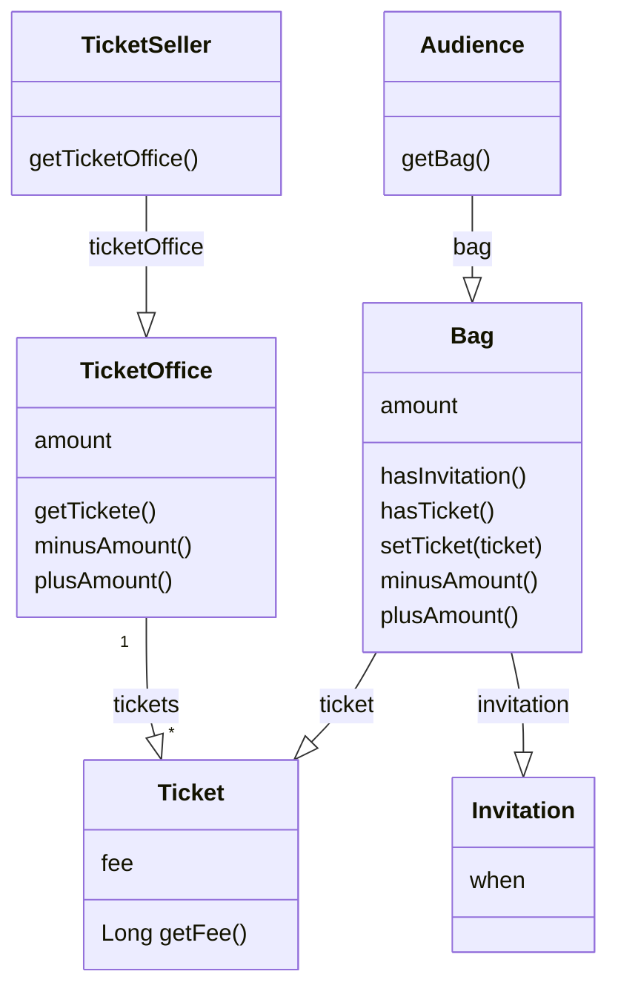

# 티켓 판매 서비스
이벤트 당첨자는 요금을 지불하지 않고 관람할 수 있다. 이벤트 당첨자가 아니면 요금을 지불해야 관람할 수 있다.

## 구현체에 대한 설명

### Ticket
공연을 관람하기 원하는 모든 사람들은 티켓을 소지해야 한다.
### TicketOffice
매표소의 역할을 한다. 매표소에는 관람객에게 판매할 티켓과 티켓의 판매 금액이 보관대 있어야 한다.
### TicketSeller
판매원은 매표소에서 초대장을 티켓으로 교환해 주거나 티켓을 판매하는 역할을 수행한다.
### Audience
관람객을 구현했다. 관람객은 소지품을 가지고 있다.
### Bag
관람객의 소지품을 보관하는 역할을 한다.
### Invitation
이벤트 당첨자에게 발송되는 초대장 역할을 한다.
### Theater
극장을 구현한 클래스이다.

## 클래스 다이어 그램

